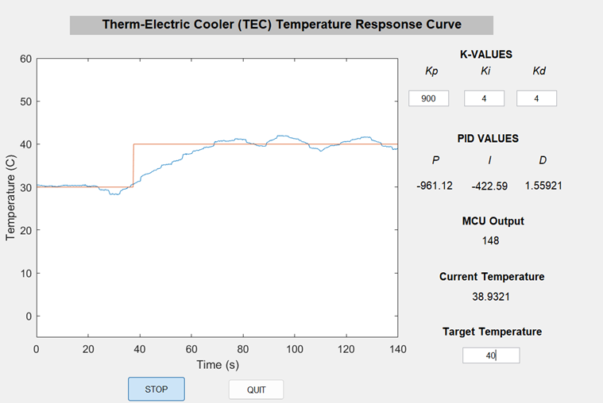

# 🌡️ PID Temperature Control System with MSP430 + MATLAB GUI

This project implements a **closed-loop temperature control system** using an MSP430 microcontroller and a **MATLAB-based GUI**. A PID (Proportional–Integral–Derivative) controller is used to regulate the temperature of a thermoelectric cooler (TEC) using real-time thermistor feedback.
---

## 📁 Project Structure
```
PID-Control-System/
├── images/
├── main.c            # MSP430 firmware for ADC sampling, UART comms, and PWM control
├── myscope.m         # MATLAB GUI controller and PID logic
├── myscope.fig       # MATLAB GUI layout file
├── README.md
```

---
## 🎯 Features

- Real-time temperature sensing using thermistor and ADC
- Serial communication between MSP430 and MATLAB via UART
- Interactive MATLAB GUI with PID tuning inputs (Kp, Ki, Kd)
- Live plotting of temperature vs. time
- Visual display of PID terms and controller output
- Bi-directional PWM control for heating and cooling (via TEC)

---

## ⚙️ Hardware & Software

### Hardware
- **MSP430 Microcontroller**
- **Thermo-Electric Cooler (TEC)**
- **Temperature Sensor**
- **Power driver circuit for TEC**

### Software
- **MSP430 C firmware **
- **MATLAB GUI for PID tuning and data plotting**
- **Serial communication protocol for data exchange**


---
